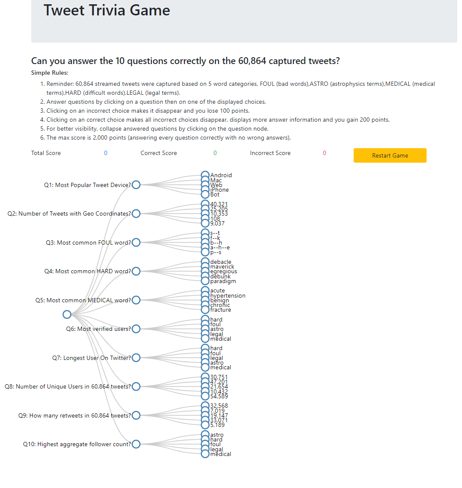

# Interactive component


```{r}
# add required packages
#require(tidyverse)
#require(ggthemes)
#require(forcats)
#require(jsonlite)
allcats <- as_tibble(read_json("./data/allWords.json",simplifyVector = TRUE))
```

```{r include=FALSE}
# Question 1: Most popular tweet device

mostpopdevice <- allcats %>% count(Source) %>% arrange(desc(n)) %>% top_n(2)

# Question 2: # of Tweets with Geo Coordinates

numgeo <- allcats %>% count(!is.na(Longitude))

# Question 3: Most popular foul word

mostfoul <- allcats %>% filter(Category == "foul") %>% count(MatchWords) %>% arrange(desc(n)) %>% top_n(5)

# Question 4: Most popular hard word

mosthard <- allcats %>% filter(Category == "hard") %>% count(MatchWords) %>% arrange(desc(n)) %>% top_n(5)

# Question 5: Most popular hard word

mostmedical <- allcats %>% filter(Category == "medical") %>% count(MatchWords) %>% arrange(desc(n)) %>% top_n(5)

# Question 6: Which group has the most verified Tweeters

mostveri <-  allcats %>% count(Category,TweetUserVerified) %>% arrange(desc(n))

# Question 7: Oldest Twitter account

longeston <- allcats %>% group_by(Category) %>% summarise(maxage = max(TweetUserDaysOn)) %>% arrange(desc(maxage))

# Question 8: How many unique users

uniques <-  allcats %>% distinct(TweetUserScreenName)

numtweets <-  allcats %>% count(TweetUserScreenName) %>% arrange(desc(n))  %>% top_n(5)

# Question 9: How many retweets?

numretweets <-  allcats %>% count(!is.na(ReTweetUserScreenName))

# Question 10: How many retweets?

mostfollowers <-  allcats %>% group_by(Category) %>% summarise(totfol = sum(TweetUserNumFollowers)) %>%  arrange(desc(totfol))

```

The D3 interactive component that we chose to build is a trivia game that asks various questions about the collected tweet data. Players get points for answering correctly and lose points for answering incorrectly. At any time, the game can be reset to its beginning state.

The game is based on [Mike Bostok's Collapsible Tree Example](https://gist.github.com/d3noob/9de0768412ac2ce5dbec430bb1370efe) with substantial functionality added to give the user feedback on questions answered correctly or incorrectly. A running score tally is displayed and the user can reset the game play at any time. 

The question tree diagram is built by reading a JSON file server from a web site. The game is hosted on a web server and displayed in an IFRAME.


<iframe src="http://localhost:3000/TwitVizTrivia.html" width="1000" height="900"></iframe>

For reference, here are all the questions and answers in one image:



